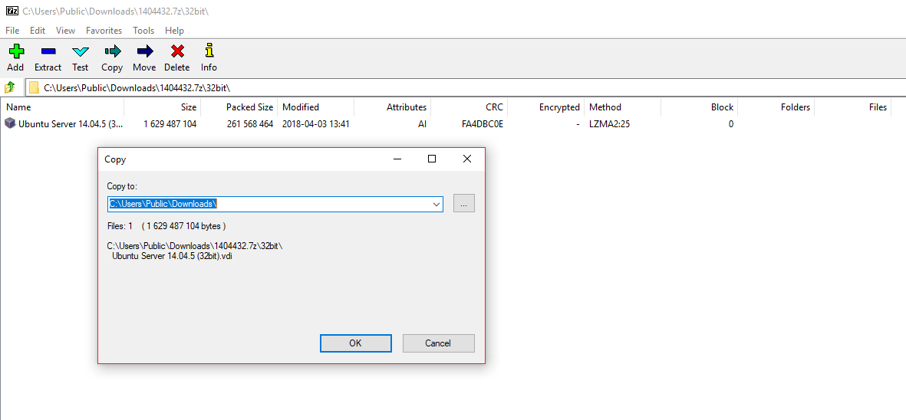
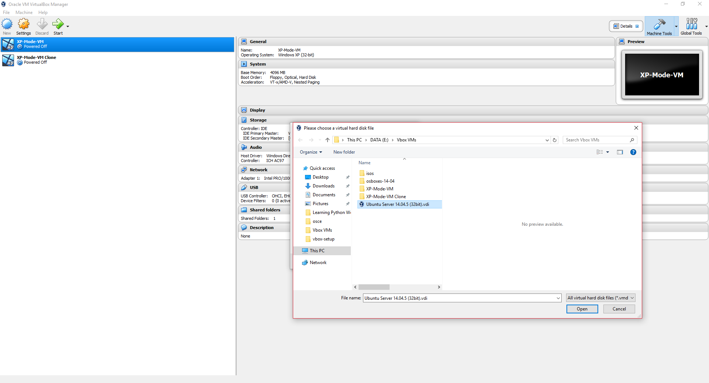
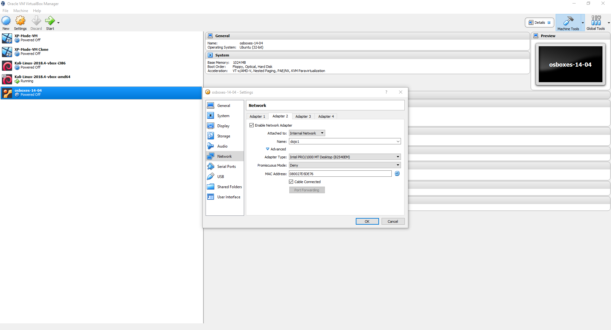
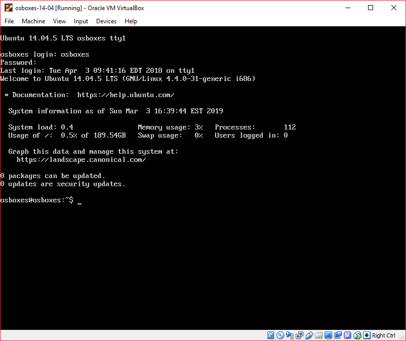
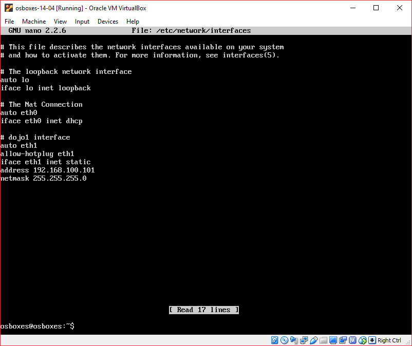

# Import a Virtual Disk Image (VDI)

A lot useful training comes from Capture the Flag exercises. Sites like [VulnHub](https://www.vulnhub.com/) have pre made VirtualBox Disk Image (VDI) files. These files are similar in function to OVAs, but only specify a data disk. You need to specify all the additional components that make up the VM. This gives you some flexibility but also requires a little more overhead. 

This Kata is going to cover the import of an Ubuntu 14.04 VDI file and some some linux networking to get the VM added to the local network.

1. First unzip the download using 7zip:



The VDI file needs a VBOX file to manage the 'hardware' for the VM. This XML formatted config points to a VHD storage file. Luckly VBox automates all of this for us in the GUI.

2. Once that has completed start creating the VM by selecting __New__ from the top left of the GUI. Give the VM a name and allocate the appropriate type an OS version. I'm calling mine osboxes-14-04 and specifying a 32 Bit Ubuntu version. 


3. Next accept the default __Memory Size__ of 1024 MB

4. Allocate the VDI by selecting the __Use existing virtual hard disk file__, selecting __Create__ once you've selected the disk.



5. At this point we have a VM that you can power up and log into with the details below:

```
Username: osboxes
Password: osboxes.org
Root Account Password: osboxes.org
VB Guest Additions & VMware Tools: Not Installed
Keyboard Layout: US (Qwerty)
VMware Compatibility: Version 10+
```
Prior to powering it on we want to add an additional NIC, like we did for the Kali Appliance.

6. Having selected the new VM appliance select the __Network__ option.
Click on Adapter 2 and the __Enable Network Adapter__ checkbox this will allow you to specify a network to connect to. Select _Internal Network_ from the __Attached to__ drop down and specify the same name you used for the internal network that you did for the Kali VM. Leave the remaining settings as default and click __OK__.



7. Next power on the VM, add the Addons Device as before and login with the credentials above.



8. edit /etc/network/interfaces to include the following (don't forget to use sudo to get write access):

```
---

# The NAT Connection
auto eth0
iface eth0 inet dhcp

# The primary network interface for internal newtork
auto eth1
allow-hotplug eth1
iface eth1 inet static
address 192.168.100.101
netmask 255.255.255.0

```
> Note, the `address 192.168.100.101` is the only difference in the configuration from our Kali OVA in the main lab.



9. Restart your network cards and check you have ip addresses:

```
sudo ifdown -a 
sudo ifup -a
ifconfig
```


10. Check you can connect to the internet, yourself and if you completed the [Import the Kali OVA to an Internal Network](kali-ova.md) you should be able to see a powered on Kali Appliance (192.168.100.100) with a ping.

```
ping google.com -c 3
ping 192.168.100.101 -c 3
ping 192.168.100.100 -c 3
```
