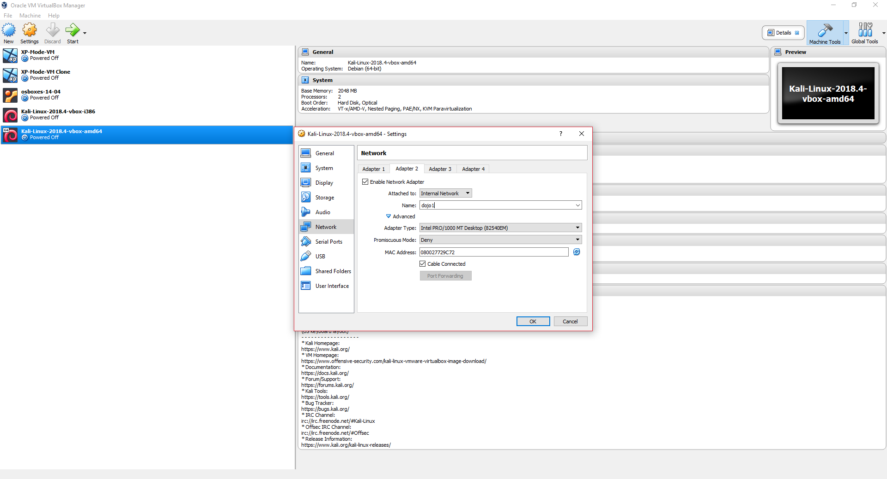
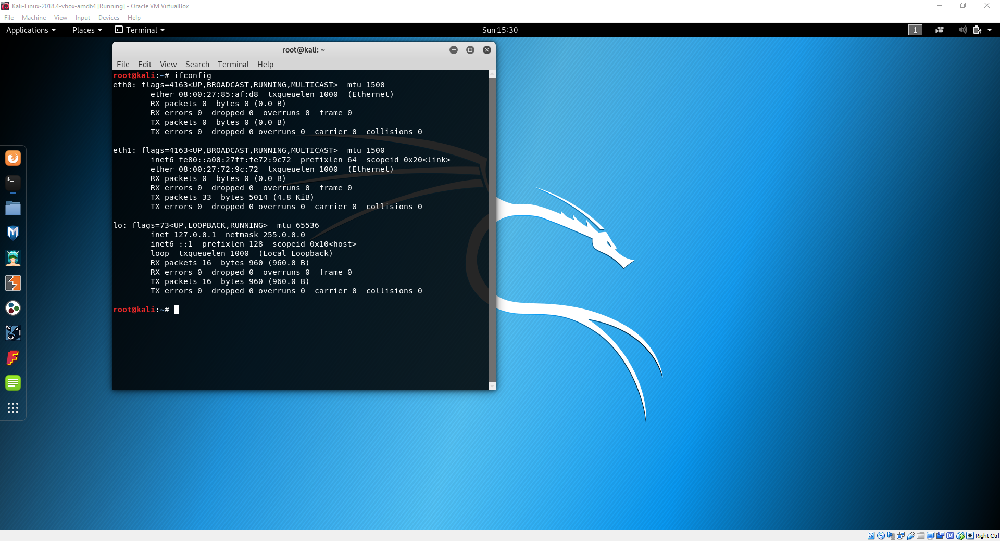
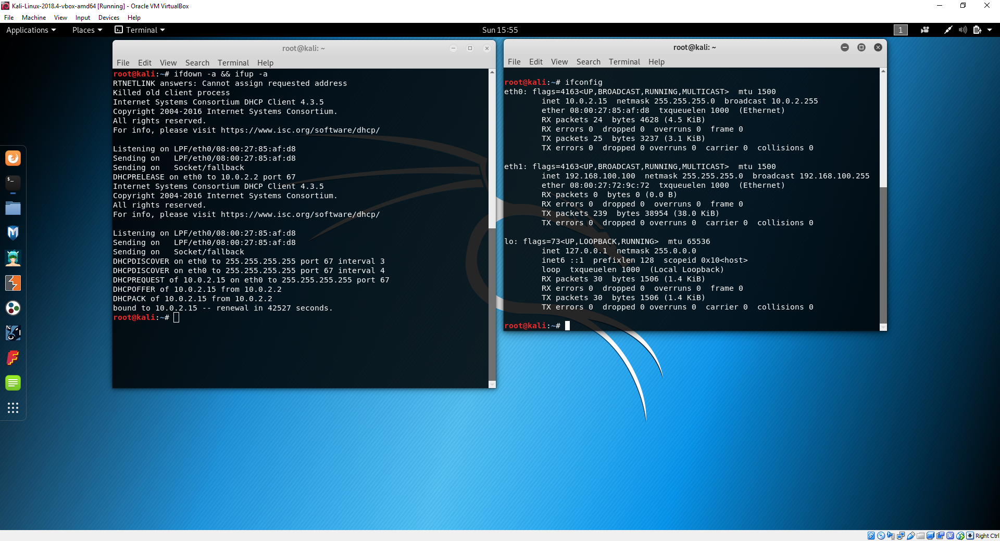

# Read Team Dojo 1: Setting up a local hacking network

In this Lab we are going to look at setting up a personal network for Offensive Security practice.
These Lab exercises will also form a baisis for pre-requisites for future Dojos.

## Prerequisites
You will need an internet connected laptop with at least 4GB of RAM that can handle virtualisation. The links provided assume that you are using the current version of VirtualBox. Please note all of the screenshots were taken using Virtual Box 5 on a Windows 10 machine.   

### Installed

Please have these installed prior to attending.

1. Virtual Box - [latest version](https://www.virtualbox.org/wiki/Downloads)
2. Virtual Box Addons - [latest version](https://download.virtualbox.org/virtualbox/6.0.4/Oracle_VM_VirtualBox_Extension_Pack-6.0.4.vbox-extpack)
3. 7zip - [latest version](https://www.7-zip.org/download.html)

### Required Downloads

> Make sure that you download the Virtual Box and not the VMware versions of these images.

These are the resources you will need for the Lab, downloading them prior to attending will ensure you have adequete time to complete all exercises. 

1. Kali VM [OVA](https://www.offensive-security.com/kali-linux-vm-vmware-virtualbox-image-download/)
2. CDX [OVA](https://drive.google.com/file/d/1JJmYtbCp52Dni1qQhGQwMO0Gl0PUfaIR/view?fbclid=IwAR2R-CPHfS__XnnmKgOy4JvQKQeIv9ych9ljAg241y_hLoO4_4WPnRMGlSk)


### Optional Downloads

These resources are required if you want to try the Additional Katas will not be required for the main dojo.

1. Os-Boxes Ubuntu Server [Pre Built Image](https://www.osboxes.org/ubuntu-server/)
2. Windows XP Mode [Windows Binary](https://www.microsoft.com/en-gb/download/confirmation.aspx?id=8002) - Don't install this!
3. Development Environment [Windows VMs](https://developer.microsoft.com/en-us/microsoft-edge/tools/vms/) 
4. Ubuntu Server [OSI](https://www.ubuntu.com/download/server) 


## 1. Setting up a basic Lab.

todo- write intro

## 2. First VM: Import the Kali OVA

This portion of the Lab we will import and configure a Kali Linux Virtual appliance for our network. Kali is the spiritual successor to Backtrack and is a Pentesting Framework built on Debian Testing. It has been designed to provide pentesters all the tools they need while removing the hassle of system configuration. By default Kali only comes with the root user, which makes it unsafe to use as a primary OS if you do not know what you are doing. Using Kali as a VM elimiates a lot of this risk as you can still use the Host's OS for your day to day activites.  

An OVA is a is the file type which VirtualBox uses to identify virtual appliances. It is a package that contains files used to describe a virtual machine, which includes an .OVF descriptor file, optional manifest (.MF) and certificate files, and other related files. We are going to import a Kali [OVA](https://www.offensive-security.com/kali-linux-vm-vmware-virtualbox-image-download/) for use in our Lab. 

Via the GUI select __File > Import__ and search for your downloaded Kali OVA. Once selected the appliance's configuration will populate in the settings window. Before you click __Import__  make sure that you check the __Reinitialize the MAC address of all network cards__ box. This will prevent networking issues later on.


After a few minutes your Appliance will be ready to power on. Click on __Devices__ and __Insert Guest Additions CD image__, which will take effect on the next re-boot. If you log in to the VM using the default credentials of:

* username: root
* password: toor

Check you have connection via NAT to the internet, by pinging Google and check out your network configuration with the following commands:

```
ping google.com -c 3 && ifconfig
```


Next we want to add a second network card so that our Kali appliance can communicate with any target machines.
Shutdown the Kali VM and retur to the GUI. Having selected the Kali appliance select the __Network__ option.
From here we can add up to an additional 3 network cards to our Kali guest. Click on Adapter 2 and the __Enable Network Adapter__ checkbox this will allow you to specify a network to connect to. Select _Internal Network_ from the __Attached to__ drop down and specify a name for the internal network in the __Name__ textbox. Leave the remaining settings as default and click __OK__.



At this point we've effectivley added a networking card, we now need to attach it to the network. Power on the appliance and log in. Check your network config to see your new adapter:

```
ifconfig
```



to connect the new NIC to the network we give our interfaces an IP address by opening `/etc/network/interfaces` in our favourite editor (nano, vim and gedit are all available in Kali be default):

```
# This file describes the network interfaces available on your system
# and how to activate them. For more information, see interfaces(5).

source /etc/network/interfaces.d/*

# The loopback network interface
auto lo
iface lo inet loopback

# The NAT Connection
auto eth0
iface eth0 inet dhcp

# The primary network interface for internal newtork
auto eth1
allow-hotplug eth1
iface eth1 inet static
address 192.168.100.100
netmask 255.255.255.0

```

Save the file and use the following commands to tear down the old settings and bring up your new configuration.

```
ifdown -a && ifup -a
```



Before moving to the next section test your connection to googel with a quick ping.

## 3. Second VM: Import the CDX OVA.

TODO - write this up with diagrams

## 4. Scan and attack the CDX System.

### nmap scanning

### reverse shells

### RCE on CDX machine

## Additional Network Katas

* [Import a Virtual Disk Image (VDI)](configure-vdi.md)
* [Free(ish) Windows XP](windows-xp.md)
* [Windows 7, 8 & 10](windows-xp.md)
* [Damn Vulnerable Web App](dvwa.md)

## Recommended Resources

### Free Educational Sites

* Metasploit Unleashed – [Free Ethical Hacking Course](https://www.offensive-security.com/metasploit-unleashed/)
* Vuln Hub - [Virtual Machines](https://www.vulnhub.com/)
* HakerOne [Hacker 101](https://www.hackerone.com/hacker101)
* Hack the Box - [CTF Site](https://www.hackthebox.eu/)
* [Cybrary](https://www.cybrary.it/)

### Getting Started Books

* [Penetration Testing: A Hands-On Introduction to Hacking](https://www.amazon.co.uk/Penetration-Testing-Hands-Introduction-Hacking/dp/1593275641/ref=asc_df_1593275641/?tag=googshopuk-21&linkCode=df0&hvadid=311013355418&hvpos=1o1&hvnetw=g&hvrand=14721075246741116845&hvpone=&hvptwo=&hvqmt=&hvdev=c&hvdvcmdl=&hvlocint=&hvlocphy=1007340&hvtargid=pla-433822384008&psc=1&th=1&psc=1)
* [Kali Unleashed](https://www.kali.org/download-kali-linux-revealed-book/)
* [RTFM: Red Team Field Manual](https://www.amazon.co.uk/Rtfm-Red-Team-Field-Manual/dp/1494295504)