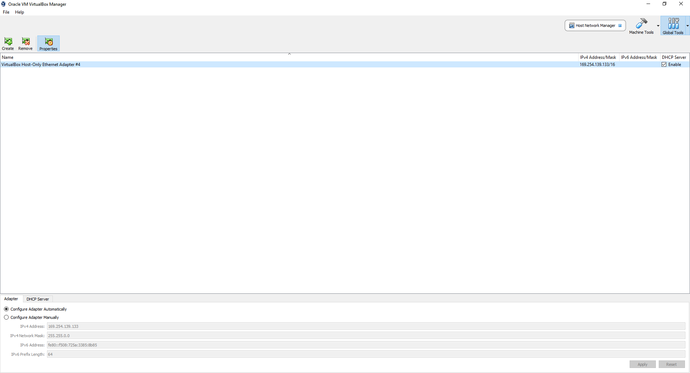
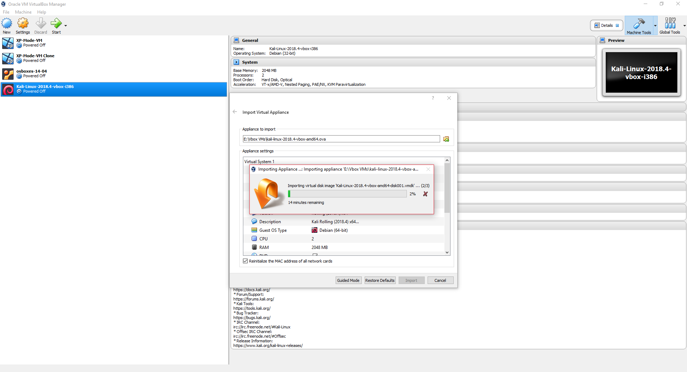
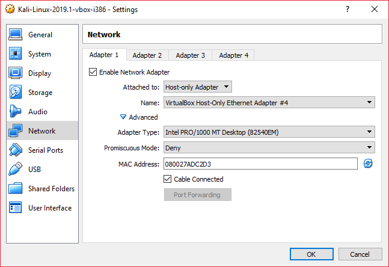
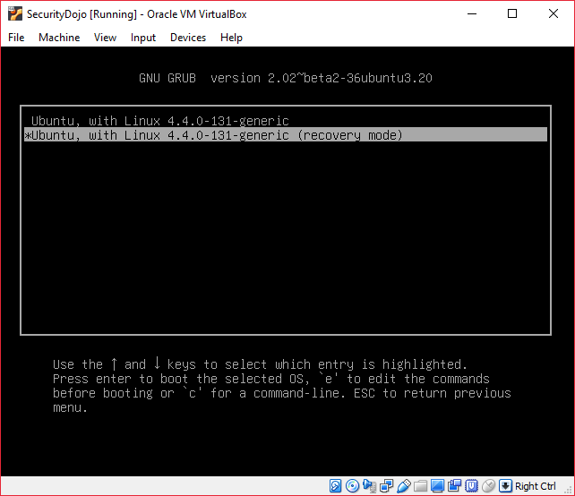
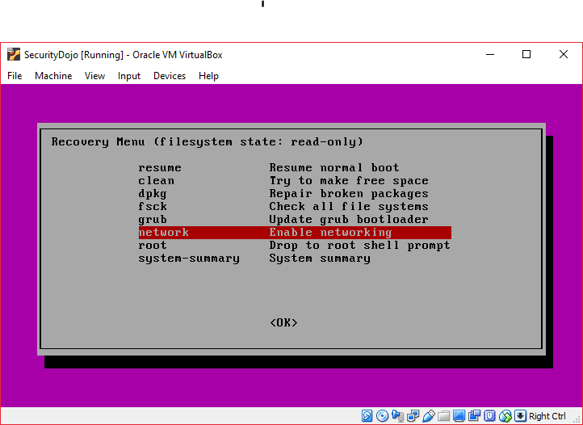
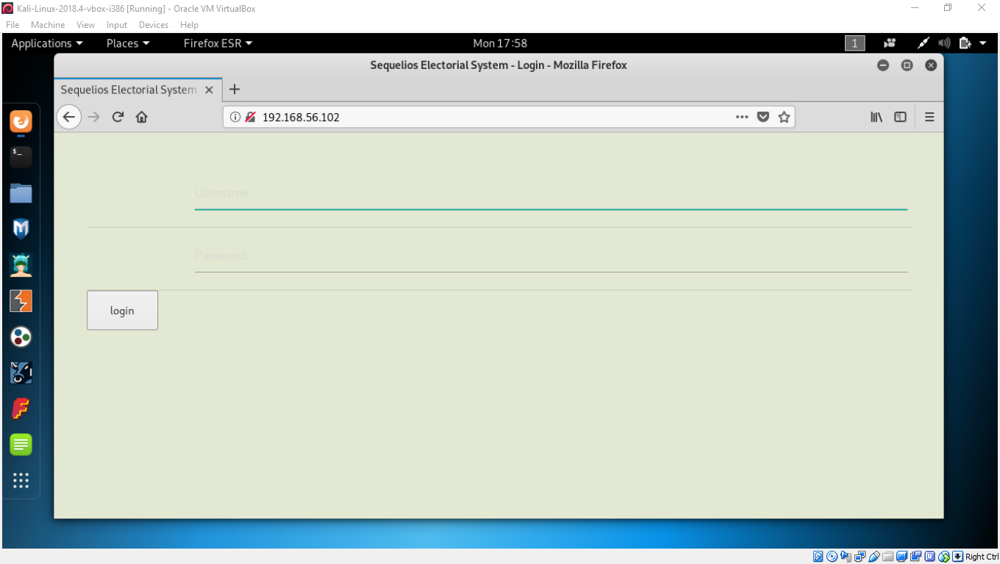

# Read Team Dojo 1: Setting up a local hacking network

In this Dojo we are going to look at setting up a personal network for Offensive Security practice.
The Katas linked near the bottom of this document will also show you where to access pre-requisites for future Dojos.

## Prerequisites

You will need an internet connected laptop with at least 4GB of RAM, 200GB of Disk Space and that can handle virtualisation. The links provided assume that you are using the current version of VirtualBox. Please note all of the screenshots were taken using Virtual Box 5 on a Windows 10 machine.   

### Installed

Please have these installed prior to attending.

1. Virtual Box - [latest version](https://www.virtualbox.org/wiki/Downloads)
If using Windows, Install this package as administrator to ensure all the virtual drivers get installed.

2. Virtual Box Addons - [latest version](https://download.virtualbox.org/virtualbox/6.0.4/Oracle_VM_VirtualBox_Extension_Pack-6.0.4.vbox-extpack)
3. 7zip - [latest version](https://www.7-zip.org/download.html)

### Required Downloads

> Make sure that you download the __Virtual Box__ and __not__ the VMware versions of these images.

These are the resources you will need for the Lab, downloading them prior to attending will ensure you have adequete time to complete all exercises. 

1. Kali VM [OVA](https://www.offensive-security.com/kali-linux-vm-vmware-virtualbox-image-download/)
2. CDX [OVA](https://drive.google.com/file/d/1JJmYtbCp52Dni1qQhGQwMO0Gl0PUfaIR/view?fbclid=IwAR2R-CPHfS__XnnmKgOy4JvQKQeIv9ych9ljAg241y_hLoO4_4WPnRMGlSk)


### Optional Downloads

These resources are required if you want to try the Additional Katas, but will not be required for the main dojo.

1. Os-Boxes Ubuntu Server [Pre Built Image](https://www.osboxes.org/ubuntu-server/)
2. Windows XP Mode [Windows Binary](https://www.microsoft.com/en-gb/download/confirmation.aspx?id=8002) - Don't install this!
3. Development Environment [Windows VMs](https://developer.microsoft.com/en-us/microsoft-edge/tools/vms/) 
4. Ubuntu Server [OSI](https://www.ubuntu.com/download/server) 


## Setting up a Basic Lab.

This Dojo comprises of a basic core (this document) and several optional katas at the end that you can use to expand your network. To begin with we will be setting up an incredibly basic Virtual Network using Virtual Box.
There are of course alternatives to this software, but Oracle's Virtual Box is free and convenient package that runs on Windows, Linux and Apple Macs.

## 1. Configure Host Only Adapter Network

In order to get a quick start we are going to hack together a quick host only network. This has the advantage of letting us get to the good stuff quickly but carries the disadvantage of removing their internet access. For more convient lab settings using internal networking and a NAT connection check out the stretch katas at the end of the main dojo.

By default, when installed, Virtual Box creates a Host Only Adapter which can be used to allow a Host system to connect to its guest VMs. This adapter is a virtual NIC, and as a vNIC it can also can be used to host multiple IP Addresses. We are going to use this capability to host a 2 VM network.

1. From the VirtualBox GUI, select __Host Network Adapter__ from the __File__ dropdown.

2. If you don't already have a _VirtualBox Host-Only Etherner Adapter_ select __Create__ to make one.

3. Right click on the __Name__ and select __properties__



4. In the __Adapter__ tab, select __Configure Adapter Automatically__ and _enable the server_ in __DHCP Server__. You can configure the network as you see fit, but the defaults are suitable for our purposes.

At this satge we have completed all the Virtual Box configuration that we need to do to complete the Lab.

## 2. First VM: Import the Kali OVA

This portion of the Lab we will import and configure a Kali Linux Virtual appliance for our network. Kali is the spiritual successor to Backtrack and is a Pentesting Framework built on Debian Testing. It has been designed to provide pentesters all the tools they need while removing the hassle of system configuration. By default Kali only comes with the root user, which makes it unsafe to use as a primary OS if you do not know what you are doing. Using Kali as a VM elimiates a lot of this risk as you can still use the Host's OS for your day to day activites.  

An OVA is a is the file type which VirtualBox uses to identify virtual appliances. It is a package that contains files used to describe a virtual machine, which includes an .OVF descriptor file, optional manifest (.MF) and certificate files, and other related files. We are going to import a Kali [OVA](https://www.offensive-security.com/kali-linux-vm-vmware-virtualbox-image-download/) for use in our Lab. 

1. Via the GUI select __File > Import__ and search for your downloaded Kali OVA. Once selected the appliance's configuration will populate in the settings window. Before you click __Import__  make sure that you __Reinitialize the MAC address of all network cards__. This will prevent networking issues later on.



2. After a few minutes your Appliance will be ready to power on. Before we do we want to configure a __Host only Adapter__ for some easy networking. Making sure the imported VM is selected click on __Network__ on the right hand side of the GUI. In Adapter 1 Changed the _Attached to:_ dropdown to __Host-only Adapter__ and click OK. 



This will connect the Appliance to the default Host Only Network on your Host device.

3. Power On the VM and in the window that pops up, select the __Devices__ menu and __Insert Guest Additions CD image__. All the features will take effect on the next re-boot, but for now log in to the VM using the default credentials of:

* username: root
* password: toor

4. Check you have connection via NAT to the internet, by pinging Google and check out your network configuration with the following commands:

```
ping google.com -c 3 && ifconfig
```


5. Take note of the IP address in eth0. In the image this is 10.0.2.15, yours may be different depending on your Host Adapter Settings.

Now you have a full fledged Kali Linux Appliance that you can use for internal assessments.

## 3. Second VM: Import the CDX OVA.

CDX or Cyber Defense eXercise is an annual hackathon which students from a local university patch vulnerable systems and, after a set period of time do their best to defend nasty Offense focused Red Team professionals like ourselves. In this part of the Dojo we are going to import one of the 2019 boxes to our lab for practice. The steps are nearly identical to the previous exercise, please refer back to them for reference diagrams.

> Depending on the storage mechanism we are using you may need to use an archive manager to extract the OVA file. 

1. Import the OVA, remembering to __Reinitialize the MAC address of all network cards__.

2. Go to the Network menu and configure Adapter 1 to be Host Only.

3. Next power up the machine and attach the Virtual Box Extensions via the device dropdown menu.

You may get an issue here with the networking job, if you do reboot / reset the system via the __Machine__ dropdown and select __Advanced Options__ from the boot menu. This will allow you to run recovery mode.



Once it boots, select __Enable networking__ from the network option.



This should pick up an IP address and then return to the menu.

4. Log into the machine with the credentials:

* username: dojo
* password: dojo

or

* username: root
* password: toor

5. Once you've logged in check your ip address with `ifconfig` and that you can ping the Kali VM.

6. From the Kali Appliance open Firefox and visit the IP address of the CDX server. You should see something similar to this:



All going well you should have your very first network.

## 4. Attack the CDX System.

The purpose of a pentest is to try and see where specific flaws in an application's stack are weak enough to allow an attacker to gain un-authorised access. Typically, in software development we leverage automated process that focus on scanning, reporting and remediating vulnerabilities. Impact pentesting takes this a step further and assesses how these weaknesses can be leveraged to further gain access to a system. This part of the Dojo we will be considering the two most used tools in an Attacker's arsenal: nmap and netcat.  


### nmap scanning

todo - what is nmap
some flags, scripting engine and nmap book / manual
introduce searchsploit and exploit db

### shells
what is a shell

#### bind shell
make a call to a server

#### reverse shell
make a call to the attacker

### RCE on CDX machine
php attack

## Additional Network Katas

* [Import the Kali OVA to an Internal Network](kali-ova.md)
* [Import a Virtual Disk Image (VDI)](configure-vdi.md)
* [Free(ish) Windows XP](windows-xp.md)
* [Windows 7, 8 & 10](windows-xp.md)
* [Damn Vulnerable Web App](dvwa.md)

## Recommended Resources

### Free Educational Sites

* Metasploit Unleashed – [Free Ethical Hacking Course](https://www.offensive-security.com/metasploit-unleashed/)
* Vuln Hub - [Virtual Machines](https://www.vulnhub.com/)
* HakerOne [Hacker 101](https://www.hackerone.com/hacker101)
* Hack the Box - [CTF Site](https://www.hackthebox.eu/)
* [Cybrary](https://www.cybrary.it/)

### Getting Started Books

* [Penetration Testing: A Hands-On Introduction to Hacking](https://www.amazon.co.uk/Penetration-Testing-Hands-Introduction-Hacking/dp/1593275641/ref=asc_df_1593275641/?tag=googshopuk-21&linkCode=df0&hvadid=311013355418&hvpos=1o1&hvnetw=g&hvrand=14721075246741116845&hvpone=&hvptwo=&hvqmt=&hvdev=c&hvdvcmdl=&hvlocint=&hvlocphy=1007340&hvtargid=pla-433822384008&psc=1&th=1&psc=1)
* [Kali Unleashed](https://www.kali.org/download-kali-linux-revealed-book/)
* [RTFM: Red Team Field Manual](https://www.amazon.co.uk/Rtfm-Red-Team-Field-Manual/dp/1494295504)