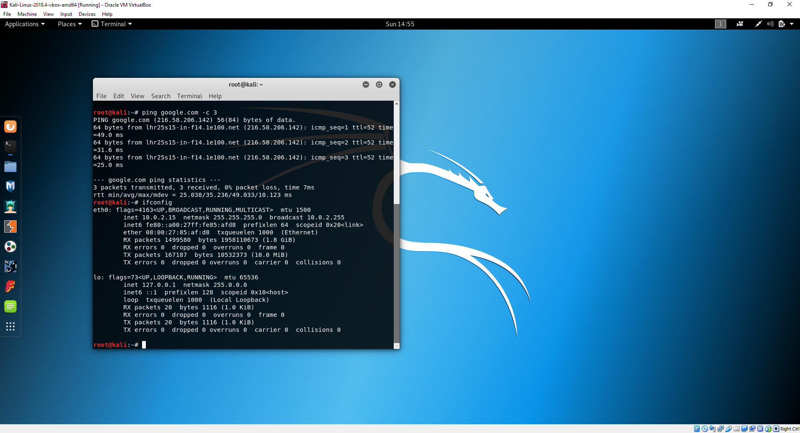

# Read Team Dojo 1: Setting up a local hacking network

In this Lab we are going to look at setting up a personal network for Offensive Security practice.
These Lab exercises will also form a baisis for pre-requisites for future Dojos.

## Prerequisites
You will need an internet connected laptop with at least 4GB of RAM that can handle virtualisation. The links provided assume that you are using the current version of VirtualBox.

### Installed
Please have these installed prior to attending.

1. Virtual Box - [latest version](https://www.virtualbox.org/wiki/Downloads)
2. Virtual Box Addons - [latest version](https://download.virtualbox.org/virtualbox/6.0.4/Oracle_VM_VirtualBox_Extension_Pack-6.0.4.vbox-extpack)
3. 7zip - [latest version](https://www.7-zip.org/download.html)

### Downloads
These are the resources you will need for the Lab, downloading them prior to attending will ensure you have adequete time to complete all exercises.

1. Ubuntu Server [OSI](https://www.ubuntu.com/download/server) 
2. Ubuntu Server [Pre Built Image](https://www.osboxes.org/ubuntu-server/)
3. Kali VM [OVA](https://www.offensive-security.com/kali-linux-vm-vmware-virtualbox-image-download/)
4. Windows XP Mode [Windows Binary](https://www.microsoft.com/en-gb/download/confirmation.aspx?id=8002) - Don't install this!
5. CDX [OVA](https://drive.google.com/file/d/1JJmYtbCp52Dni1qQhGQwMO0Gl0PUfaIR/view?fbclid=IwAR2R-CPHfS__XnnmKgOy4JvQKQeIv9ych9ljAg241y_hLoO4_4WPnRMGlSk)

## 1. Virtual Box: How does it Work?

Open Virtual Box, take a moment to familiarise yourself with the interface. At the top left you have the tools to manage machines and various configuration settings available in Virtual Box. After you have created your first VM its details will populate on the right.

In order for us to create a safe network for testing the first thing we should do is set up a VM on local network space so that our attacker and defender VMs can communicate to one another without affecting the public network our host devices use. Before we do this however it is prudent to install the [Oracle VM VirtualBox Extension Pack](https://download.virtualbox.org/virtualbox/6.0.4/Oracle_VM_VirtualBox_Extension_Pack-6.0.4.vbox-extpack). The Extension Pack adds functionality for USB, RDP and a whole host of other cool features that aren't shipped in the standard VirtualBox program.

If you are using windows, double clicking on the downloaded binary should install the package, you can manually attach it via the GUI via __File > Preferences > Extensions__ and select the plus icon. Without the extension pack we will run into performance isues when we attempt the later activities.


## 2. First VM: Import an OVA

This portion of the Lab we will import and configure a Kali Linux Virtual appliance for our network. Kali is the spiritual successor to Backtrack and is a Pentesting Framework built on Debian Testing. It has been designed to provide pentesters all the tools they need while removing the hassle of system configuration. By default Kali only comes with the root user, which makes it unsafe to use as a primary OS if you do not know what you are doing. Using Kali as a VM elimiates a lot of this risk as you can still use the Host's OS for your day to day activites.  

An OVA is a is the file type which VirtualBox uses to identify virtual appliances. It is a package that contains files used to describe a virtual machine, which includes an .OVF descriptor file, optional manifest (.MF) and certificate files, and other related files. We are going to import a Kali [OVA](https://www.offensive-security.com/kali-linux-vm-vmware-virtualbox-image-download/) for use in our Lab. 

Via the GUI select __File > Import__ and search for your downloaded Kali OVA. Once selected the appliance's configuration will populate in the settings window. Before you click __Import__  make sure that you check the __Reinitialize the MAC address of all network cards__ box. This will prevent networking issues later on.


After a few minutes your Appliance will be ready to power on. Click on __Devices__ and __Insert Guest Additions CD image__, which will take effect on the next re-boot. If you log in to the VM using the default credentials of:

* username: root
* password: toor

Check you have connection via NAT to the internet, by pinging Google and check out your network configuration with the following commands:

```
ping google.com -c 3 && ifconfig
```



Next we want to add a second network card so that our Kali appliance can communicate with any target machines.
Shutdown the Kali VM and retur to the GUI. Having selected the Kali appliance select the __Network__ option.
From here we can add up to an additional 3 network cards to our Kali guest. Click on Adapter 2 and the __Enable Network Adapter__ checkbox this will allow you to specify a network to connect to. Select _Internal Network_ from the __Attached to__ drop down and specify a name for the internal network in the __Name__ textbox. Leave the remaining settings as default and click __OK__.


At this point we've effectivley added a networking card, we now need to attach it to the network. Power on the appliance and log in. Check your network config to see your new adapter:

```
ifconfig
```


to connect the new NIC to the network we give our interfaces an IP address by opening `/etc/network/interfaces` in our favourite editor (nano, vim and gedit are all available in Kali be default):

```
# This file describes the network interfaces available on your system
# and how to activate them. For more information, see interfaces(5).

source /etc/network/interfaces.d/*

# The loopback network interface
auto lo
iface lo inet loopback

# The NAT Connection
auto eth0
iface eth0 inet dhcp

# The primary network interface for internal newtork
auto eth1
allow-hotplug eth1
iface eth1 inet static
address 192.168.100.100
netmask 255.255.255.0

```

Save the file and use the following commands to tear down the old settings and bring up your new configuration.

```
ifdown -a && ifup -a
```


Before moving to the next section test your connection to googel with a quick ping.

## 3. Second VM: Import a Virtual Disk Image (VDI)

A lot useful training comes from Capture the Flag exercises. Sites like [VulnHub](https://www.vulnhub.com/) have pre made VirtualBox Disk Image (VDI) files. These files are similar in function to OVAs, but only specify a data disk. You need to specify all the additional components that make up the VM.

First I needed to unzip the download:


The VDI file needs a VBOX file to manage the 'hardware' for the VM. This XML formatted config points to a VHD storage file. Luckly VBox automates all of this for us in the GUI.

Once that has completed start creating the VM by selecting __New__ from the top left of the GUI. Give the VM a name and allocate the appropriate type an OS version. I'm calling mine osboxes-14-04 and specifying a 32 Bit Ubuntu version. 


Next accept the default __Memory Size__ of 1024 MB

Next Allocate the VDI by selecting the __Use existing virtual hard disk file__, selecting __Create__ once you've selected the disk.


At this point we have a VM that you can power up and log into with the details below:

```
Username: osboxes
Password: osboxes.org
Root Account Password: osboxes.org
VB Guest Additions & VMware Tools: Not Installed
Keyboard Layout: US (Qwerty)
VMware Compatibility: Version 10+
```
Prior to powering it on we want to add an additional NIC, like we did for the Kali Appliance.

Having selected the new VM appliance select the __Network__ option.
Click on Adapter 2 and the __Enable Network Adapter__ checkbox this will allow you to specify a network to connect to. Select _Internal Network_ from the __Attached to__ drop down and specify the same name you used for the internal network that you did for the Kali VM. Leave the remaining settings as default and click __OK__.


Next power on the VM, add the Addons Device as before and login with the credentials above.


edit /etc/network/interfaces to include the following (don't forget sudo):

```
---

# The NAT Connection
auto eth0
iface eth0 inet dhcp

# The primary network interface for internal newtork
auto eth1
allow-hotplug eth1
iface eth1 inet static
address 192.168.100.101
netmask 255.255.255.0

```
> Note the `address 192.168.100.101` is the only difference in the configuration.


restart your network cards and check you have ip addresses:

```
sudo ifdown -a 
sudo ifup -a
ifconfig
```


check you can connect to the internet, yourself and the Kali Appliance.

```
ping google.com -c 3
ping 192.168.100.100 -c 3
ping 192.168.100.101 -c 3
```

## 4. Fourth VM: Free(ish) Windows XP

Most Hacking Resources call for a copy of Windows XP. This is because XP is seriously broken and offers great oppertunities for lower level hacking. Microsoft removed support (and tha ability to purchase) XP a while back making it difficult to get a copy of windows XP for practice. Did you know that every copy of Windows 7 has the ability to run XP compatible programs as part of a Virtual Machine?

This ability comes from a tool called XP Mode. XP Mode is a binary file that contains a pretty sizable windows XP Virtual Hard Disk (VHD) 

Using 7-zip extract all the files from the __WindowsXPMode_en-us.exe__ executable binary. 


Drill into the extracted sources folder and extract the xpm file. 


Rename VirtualXPVHD to VirtualXPVHD.vhd and ensure that the Attributes are not set to read only. Additionally rename KEY to KEY.txt. Be sure to copy these files to where ever you want to keep your Lab VM details.

Open Virtual Box and create a New Microsoft Windows VM, I'm calling mine XP-Mode-VM and specifying a 32 Bit Windows XP version.

As the VM is 32 bit all RAM above 4 GB is wasted, in fact most use cases for testing won't need more than 1 GB. While we are installing a base syetm it is worth putting as much RAM as practically possible into the VM, I have enough spare for 4096 MB, so that's what I'm going to do. This can always be re-sized later if needed.

Now we need to select the extracted VirtualXPVHD.vhd as an existing virtual disk.

At this point we can create shared folders, enable RDP, network settings and customise the base image further. We'll leave this to the reader as a stretch exercise.

Once we're happy with the basic setup its time to power on the VM and go through the installation process. 

[unzip xpm](images/dojo1/power-on.png)

Be sure to configure Region, Language and Keyboard. Pick a good machine name and Admin creds admin:lab

After the re-boot, be sure to select No updates and then activate the windows VM. (Remember KEY.txt? yup it has the key you need.)

### Troubleshooting

XP install goes blank: After the first install steps the screen goes blank and doesn't return. I only had this issue with Virtual Box, VMWare and Hper-V shouldn't have this issue. I found that a reboot of the VM after a few minutes of blank screen fixed this. Install [VBox Addons](https://docs.oracle.com/cd/E36500_01/E36502/html/qs-guest-additions.html) to fix this. 

XP install doesn't recognise my mouse: Its a VBox thing, alas I couldn't find a quick fix for this but you can navigate the menus with TAB, space, arrow keys and Return to make your selections. [VBox Addons](https://docs.oracle.com/cd/E36500_01/E36502/html/qs-guest-additions.html) should also fix this.

I can't get to the internet: Check that you can ping google.com. the version of IE that ships with the VM is properly defunct and is actually very risky to use on the open internet. Download Firefox ESR if you need internet views.

Can't activate Windows: This is because TLS 1.2 is required for updating and XP just doesn't have that! 

### XP regedit Hack - Informational Only

> This will breach your XP software agreement!!! (And actually forces a blue screen long term)

Back in the day a lot of people used to get themselves a free copy of XP by hacking out variables on the registry. This practice still happens with 'free' versions of microsoft software. Sometimes you will need a valid copy of XP to configure legacy software correctly.

The XP VM can be temporarily activated via a reg edit hack, however longterm it will brick the VM and you'll need to perform additional reg-hacks in a revovery shell. 

Copy the code below into [activate.reg](files/WinXPActivate.reg) and run it on your XP machine

```
Windows Registry Editor Version 5.00
[HKEY_LOCAL_MACHINE\SOFTWARE\Microsoft\Windows NT\CurrentVersion\WPAEvents]
"OOBETimer"=hex:ff,d5,71,d6,8b,6a,8d,6f,d5,33,93,fd
; Original setting:
; "OOBETimer"=hex:eb,54,8c,c6,0e,45,17,59,55,5b,f4,30
```

next go to a cmd prompt and run 

```
regedit
```

next got to HKEY_LOCAL_MACHINE\SOFTWARE\Microsoft\Windows NT\CurrentVersion\WPAEvents and change the folder permissions to Deny Full Control for the SYSTEM user.


return to the cmd prompt and run `msoobe /a`
if it isn't in your PATH the command is in System32 directory.

if everything has worked you will see a pop up like this: 


reset the Full control and read permissions on HKEY_LOCAL_MACHINE\SOFTWARE\Microsoft\Windows NT\CurrentVersion\WPAEvents and run msoobe /a again and it will still be active.

If the window does not appear, don't worry the command may still have worked, reset the registry permissions and run the command again. You should now see an activated copy of Windows. 

## 5. Stretch Activities (Optional)

1. Make Clones of all the VMs, investigate the different types.
2. Play with the CDX Boxes
3. Attempt RDP/SSH from your Host.
4. Try an install an OS from scratch and fetch software from eploitdB.
5. Explore Shared Disk
