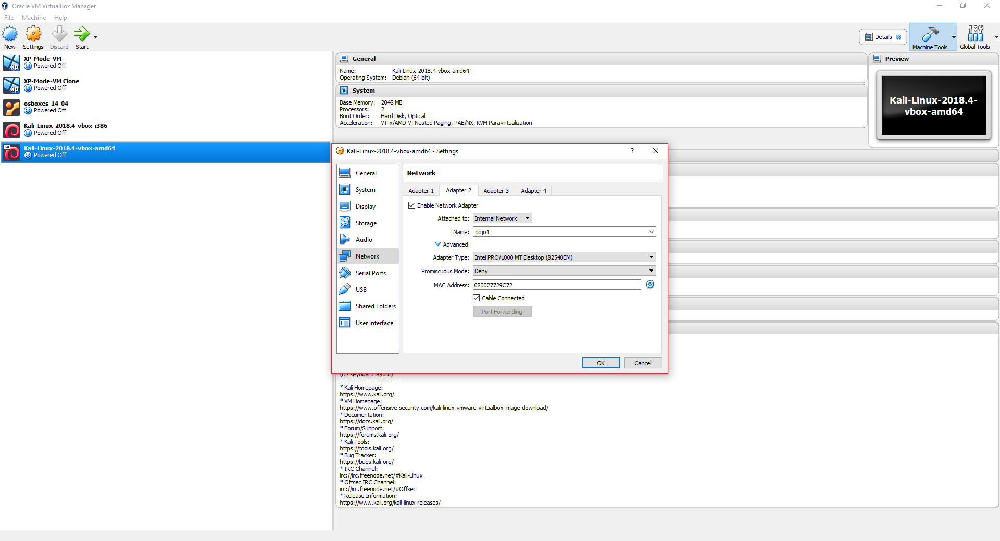

# Import the Kali OVA to an Internal Network.

This portion of the Lab we will cover the manual import and network configuration of a Kali Linux Virtual appliance for our network. Making the assumtion that we will be creating a new VM, we look to the GUI. Select __File > Import__ and search for your downloaded Kali OVA. Once selected the appliance's configuration will populate in the settings window. Before you click __Import__  make sure that you __Reinitialize the MAC address of all network cards__. This may take the form of a dropdown or checkbox depending on your version of VirtualBox. Multiple VMs with the same MAC address will cause issues on a network, so it is important to do this with any new VM you want to add to your network.


After a few minutes your Appliance will be ready to power on. Click on __Devices__ and __Insert Guest Additions CD image__, which will take effect on the next re-boot. If you log in to the VM using the default credentials of:

* username: root
* password: toor

Check you have connection via NAT to the internet, by pinging Google and check out your network configuration with the following commands:

```
ping google.com -c 3 && ifconfig
```


Next we want to add a second network card so that our Kali appliance can communicate with any target machines.
Shutdown the Kali VM and retur to the GUI. Having selected the Kali appliance select the __Network__ option.
From here we can add up to an additional 3 network cards to our Kali guest. Click on Adapter 2 and the __Enable Network Adapter__ checkbox this will allow you to specify a network to connect to. Select _Internal Network_ from the __Attached to__ drop down and specify a name for the internal network in the __Name__ textbox. Leave the remaining settings as default and click __OK__.



At this point we've effectivley added a networking card, we now need to attach it to the network. Power on the appliance and log in. Check your network config to see your new adapter:

```
ifconfig
```


to connect the new NIC to the network we give our interfaces an IP address by opening `/etc/network/interfaces` in our favourite editor (nano, vim and gedit are all available in Kali be default):

```
# This file describes the network interfaces available on your system
# and how to activate them. For more information, see interfaces(5).

source /etc/network/interfaces.d/*

# The loopback network interface
auto lo
iface lo inet loopback

# The NAT Connection
auto eth0
iface eth0 inet dhcp

# The primary network interface for internal newtork
auto eth1
allow-hotplug eth1
iface eth1 inet static
address 192.168.100.100
netmask 255.255.255.0

```

Save the file and use the following commands to tear down the old settings and bring up your new configuration.

```
ifdown -a && ifup -a
```


Before moving to the next section test your connection to google with a quick ping.