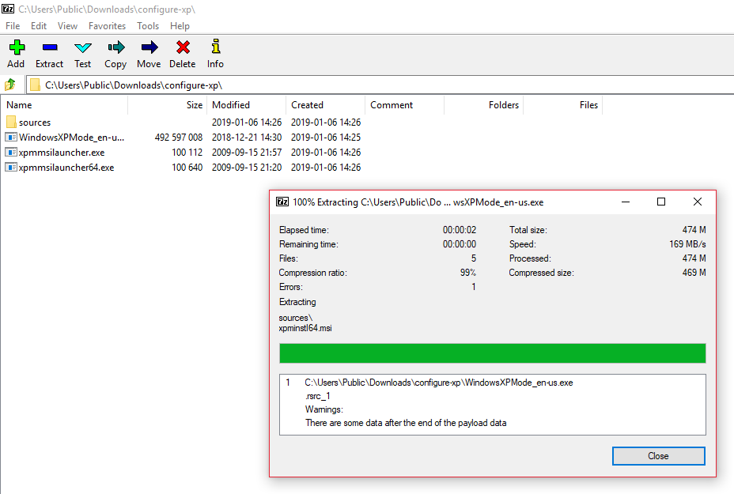
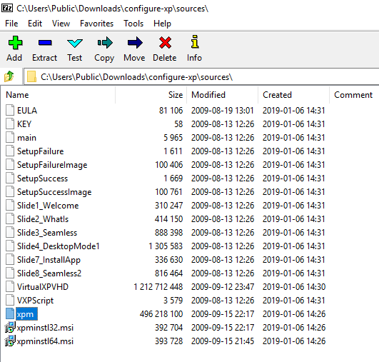

# Free(ish) Windows XP

Most Hacking Resources call for a copy of Windows XP. This is because XP is seriously broken and offers great oppertunities for learning lower level hacking. Microsoft removed support (and tha ability to purchase) XP a while back making, it difficult to get a copy of windows XP for practice. Did you know that every copy of Windows 7 has the ability to run XP compatible programs as part of a Virtual Machine?

This ability comes from a tool called XP Mode. XP Mode is a binary file that contains a pretty sizable windows XP Virtual Hard Disk (VHD) 

1. Using 7-zip extract all the files from the __WindowsXPMode_en-us.exe__ executable binary. 

2. Drill into the extracted sources folder and extract the xpm file. (You Mac folks might need to give xpm the file extension .7z if you are not using 7zip.)

3. Rename VirtualXPVHD to VirtualXPVHD.vhd and ensure that the Attributes are not set to read only. This will help us avoid file association issues later.

4. Additionally, it is convienient to rename KEY to KEY.txt. KEY.txt is where you will find the Microsoft activation code for your XP VM.

5. Open Virtual Box and create a New Microsoft Windows VM, I'm calling mine XP-Mode-VM and specifying a 32 Bit Windows XP version.

6. As the VM is 32 bit all RAM above 4 GB is wasted, in fact most use cases for testing won't need more than 1 GB. While we are installing a base syetm it is worth allocating as much RAM as practically possible into the VM. I have enough spare for 4096 MB, so that's what I'm going to do. This can always be re-sized later if needed.

7. Next select the extracted VirtualXPVHD.vhd as an existing virtual disk.

At this point we can create shared folders, enable RDP, network settings and customise the base image further. We'll skip this in favour of pressing on with a basic installation.

8. Once we're happy with the basic configuration power on the VM and go through the installation process. (Remember to attach Virtual Box Addons in the Devices dropdown menu)

9. Be sure to configure Region, Language and Keyboard. Pick a good machine name and easy to remember Admin creds admin:lab. As this is XP and we won't be using it other than in a testing network we don't care about the system. 

10. After the re-boot, be sure to select No updates and then activate the windows VM. (Remember KEY.txt? yup it has the key you need.) __UPDATE__ You will be unable to activate the XP via the built in mechanism. This is because Microsoft have abandoned Secure Socket connections < TLS 1.2. As XP only supports up to TLS 1.1, you will need to follow the on screen instructions to activate over the phone. As is, the VM will be in evaluation mode, which is active for 30 days.

### Troubleshooting

XP install goes blank: After the first install steps the screen goes blank and doesn't return. I only had this issue with Virtual Box, VMWare and Hper-V shouldn't have this issue a reboot of the VM after a few minutes of blank screen fixed this. Install [VBox Addons](https://docs.oracle.com/cd/E36500_01/E36502/html/qs-guest-additions.html) to fix this. I found that giving the VHD the .vhd extension helped avoid this issue. 

XP install doesn't recognise my mouse: Its a VBox thing, alas I couldn't find a quick fix for this but you can navigate the menus with TAB, space, arrow keys and Return to make your selections. [VBox Addons](https://docs.oracle.com/cd/E36500_01/E36502/html/qs-guest-additions.html) should also help fix this.

I can't get to the internet: Check that you can ping google.com. the version of IE that ships with the VM is properly defunct (great for exploit testing) and is actually very risky to use on the open internet. Download Firefox ESR if you need internet views.

Can't activate Windows: This is because TLS 1.2 is required for updating and XP just doesn't have that! (see updated above)
The Key.txt file you took contains the product key required to activate Windows XP. You can use this to activate windows, but you will need to call Microsoft support to do so.
I typically just leave XP systems in evaluation mode, and rebuild a new OS from scratch when I need XP. This way I can ensure a clean system.
